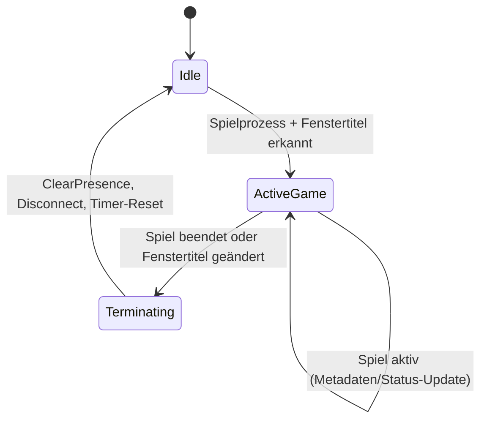

# Silent Hill Universal Discord Rich Presence Service

Ein leichtgewichtiger, robuster C# (.NET) Hintergrunddienst zur automatischen Erkennung und Anzeige von Silent Hill Spielen in Discord – sowohl für emulierte Titel (DuckStation, PCSX2 etc.) als auch für modifizierte PC-Ports (Reloaded-II, Enhanced Edition, GOG).

---

## 1. Problemstellung & Lösung

### Fall A: Silent Hill 1 (DuckStation)
* **Problem:** Discords Standarderkennung sieht lediglich die Emulator-Executable (z. B. `duckstation-qt-x64-ReleaseLTCG.exe`). Discord zeigt entweder nur den Emulatornamen, keine Aktivität oder keine spielspezifischen Daten. Bei anderen PS1-Spielen kann nicht differenziert werden.
* **Lösung:** Zweistufige Erkennung: Der Daemon prüft nicht nur auf den Prozessnamen, sondern wertet den Fenstertitel (`MainWindowTitle` & Win32 EnumWindows) auf das Muster `Silent Hill` aus. Läuft DuckStation im Menü oder mit einem anderen Spiel, wird Silent Hill nicht getriggert.

### Fall B: Silent Hill 3 (Reloaded-II / PC)
* **Problem:** Silent Hill 3 läuft unter dem Prozessnamen `sh3.exe`. Discords interne Datenbank ordnet dies fälschlicherweise der U-Boot-Simulation *Silent Hunter 3* zu.
* **Lösung:** Der Daemon umgeht Discords native Erkennung und sendet über Discords lokale Named-Pipe-IPC direkt maßgeschneiderte Rich-Presence-Profile mit verifizierten Assets und Beschreibungen.

---

## 2. Multi-App-Architektur in Discord

Discord zeigt als Hauptüberschrift immer: **„Spielt [Name der Discord-Applikation]“**.
Um perfekte Titelanzeigen wie *„Spielt Silent Hill“* oder *„Spielt Silent Hill 3“* zu erhalten, nutzt das System separate Discord-Applikationen im Discord Developer Portal.

### Einrichtung im Discord Developer Portal:

1. Gehe zu [Discord Developer Portal](https://discord.com/developers/applications) und logge dich ein.
2. Erstelle für jedes Spiel eine neue Applikation (Klick auf **New Application**):
   * App 1: Name = `Silent Hill`
   * App 2: Name = `Silent Hill 3`
   *(Optional: `Silent Hill 2`, `Silent Hill 4: The Room`)*
3. **Application ID kopieren:**
   * Gehe in der jeweiligen App auf **General Information** und kopiere die **Application ID**.
   * Trage die ID in der `appsettings.json` unter dem jeweiligen Spielprofil bei `DiscordApplicationId` ein.
4. **Rich Presence Assets hochladen:**
   * Klicke im Menü links auf **Rich Presence** -> **Art Assets**.
   * Lade unter **Rich Presence Assets** das Cover-Art und ggf. Emulator-/Plattform-Icons hoch:
     * Beispiel für SH1: `sh1_cover` (Großes Cover) und `ps1_icon` (DuckStation/PS1 Icon).
     * Beispiel für SH3: `sh3_cover` und `reloaded_icon`.
   * *Hinweis: Die Dateinamen (Keys) müssen exakt mit den Einträgen `LargeImageKey` und `SmallImageKey` in `appsettings.json` übereinstimmen.*
5. **Discord Standard-Erkennung für SH3 deaktivieren:**
   * In Discord unter *Benutzereinstellungen* -> *Aktivitätseinstellungen / Registrierte Spiele*:
   * Falls `sh3.exe` als *Silent Hunter 3* gelistet ist, entferne das Spiel oder deaktiviere das Overlay / die Aktivitätsanzeige für diesen Prozess.

---

## 3. Architektur & Komponenten

Das Projekt ist nach sauberem Schichten- und Komponentenmodell aufgebaut:

```
SilentHillEmulatorRPC/
├── src/SilentHillEmulatorRPC/
│   ├── Configuration/
│   │   ├── AppConfig.cs            # Zentrale Daemon-Einstellungen
│   │   └── GameProfile.cs          # Datengetriebenes Profil-Modell pro Spiel
│   ├── Detection/
│   │   ├── IProcessProvider.cs     # Abstraktion für Prozessabfragen
│   │   ├── SystemProcessProvider.cs# Win32 EnumWindows + Process Poller
│   │   ├── IGameDetector.cs        # Evaluator für Prozess- & Fenstertitel-Regeln
│   │   ├── GameDetector.cs         # Regex/Substring-Matcher & Token-Interpolation
│   │   ├── ProcessSnapshot.cs      # Immutable Prozess-Snapshot
│   │   └── GameMatchResult.cs      # Evaluierte Match-Metadaten
│   ├── Discord/
│   │   ├── IDiscordCoordinator.cs  # Schnittstelle für Discord IPC
│   │   └── DiscordCoordinator.cs   # Verwaltet DiscordRpcClient, Multi-App Switching
│   ├── State/
│   │   ├── ServiceState.cs         # Idle, ActiveGame, Terminating
│   │   └── RpcStateMachine.cs      # Statusübergänge & Session-Timer (Elapsed Time)
│   ├── Worker/
│   │   └── RpcWorkerService.cs     # BackgroundService Polling-Loop
│   ├── appsettings.json            # Vorkonfigurierte Spielprofile
│   └── Program.cs                  # HostBuilder, Dependency Injection & Banner
└── tests/SilentHillEmulatorRPC.Tests/
    ├── GameDetectorTests.cs        # 14 Unit-Tests für Matcher & Regex
    └── RpcStateMachineTests.cs     # Unit-Tests für State Transitions & Timer
```

### State Machine Ablauf:



---

## 4. Konfiguration (`appsettings.json`)

Die Konfiguration unterstützt Hot-Reload (Änderungen werden während der Laufzeit ohne Neustart übernommen).

```json
{
  "DiscordRpc": {
    "PollingIntervalSeconds": 3,
    "ReconnectDelaySeconds": 5,
    "AutoReconnect": true,
    "Games": [
      {
        "Identifier": "SH1_DUCK",
        "DisplayName": "Silent Hill 1 (DuckStation)",
        "Enabled": true,
        "DiscordApplicationId": "HIER_DEINE_SH1_APP_ID_EINTRAGEN",
        "ProcessNames": [
          "duckstation-qt-x64-ReleaseLTCG",
          "duckstation-nogui-x64-ReleaseLTCG",
          "duckstation-qt",
          "duckstation"
        ],
        "TitlePattern": "Silent Hill",
        "LargeImageKey": "sh1_cover",
        "LargeImageText": "Silent Hill (1999)",
        "SmallImageKey": "ps1_icon",
        "SmallImageText": "DuckStation PS1 Emulator",
        "DefaultDetailsText": "In the Fog: Silent Hill",
        "DefaultStateText": "Exploring the Town"
      },
      {
        "Identifier": "SH3_RELOADED",
        "DisplayName": "Silent Hill 3 (PC / Reloaded-II)",
        "Enabled": true,
        "DiscordApplicationId": "HIER_DEINE_SH3_APP_ID_EINTRAGEN",
        "ProcessNames": [
          "sh3",
          "sh3-reloaded"
        ],
        "TitlePattern": null,
        "LargeImageKey": "sh3_cover",
        "LargeImageText": "Silent Hill 3",
        "SmallImageKey": "reloaded_icon",
        "SmallImageText": "Reloaded-II Mod Loader",
        "DefaultDetailsText": "Heather Mason's Nightmare",
        "DefaultStateText": "Surviving the Otherworld"
      }
    ]
  }
}
```

### Dynamische Platzhalter (Tokens):
Folgende Platzhalter können in `DefaultDetailsText`, `DefaultStateText` oder `LargeImageText` verwendet werden:
* `{Title}`: Der ausgelesene Fenstertitel des Spiels.
* `{ProcessName}`: Name des laufenden Prozesses.
* `{DisplayName}`: Der konfigurierte Anzeigename.
* `{Identifier}`: Das Profil-Kürzel.
* Benannte Regex-Gruppen: Wenn `TitlePattern` z. B. `Silent Hill (\((?<Region>[^)]+)\))` nutzt, kann `{Region}` als Variable verwendet werden.

---

## 5. Kompilieren & Ausführen

### Voraussetzungen:
* .NET 8.0, 9.0 oder 10.0 SDK
* Windows 10/11 x64

### Ausführen im Entwicklungsmodus:
```powershell
cd src\SilentHillEmulatorRPC
dotnet run
```

### Tests ausführen:
```powershell
dotnet test
```

### Als eigenständige `.exe` veröffentlichen (Single-File):
```powershell
dotnet publish src\SilentHillEmulatorRPC\SilentHillEmulatorRPC.csproj -c Release -r win-x64 --self-contained true -p:PublishSingleFile=true -o publish\
```
Die fertige `SilentHillEmulatorRPC.exe` mitsamt `appsettings.json` befindet sich anschließend im Ordner `publish/`.

### Autostart im Hintergrund (Windows):
Erstelle eine Verknüpfung im Windows-Autostart-Ordner (`shell:startup`) oder nutze die Windows-Aufgabenplanung (*Task Scheduler*), um die Anwendung beim Systemstart minimiert auszuführen.
